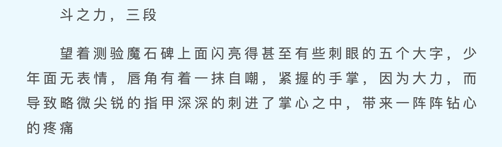

# 介绍
继承rapidOCR打包成二进制命令，可以CLI方式识别图片信息

# 构建

```shell
pip install -r requirements.txt
pyinstaller rapidocr.spec
```

# 使用
```shell
dist/rapidocr -p test.jpg
```


```text
{"result": "斗之力，三段\n望着测验魔石碑上面闪亮得甚至有些刺眼的五个大字，少\n年面无表情，唇角有着一抹自嘲，紧握的手掌，因为大力，而\n导致略微尖锐的指甲深深的刺进了掌心之中，带来一阵阵钻心\n的疼痛\n"}
```
